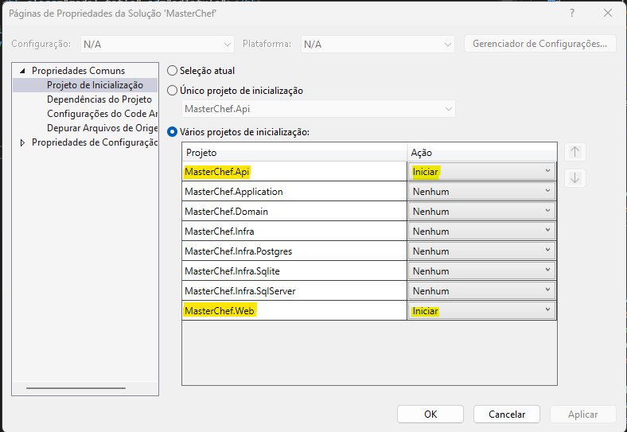
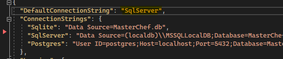

# Projeto MasterChef

### Projeto de final do curso de desenvolvimento WEB do MBA FIAP

Para iniciar o projeto, ir em **solução**, **propriedades** e ativar ***"Varios Projetos de inicialização"***

- Selecionar "MasterChef.Api" e "MasterChef.UI"

---
Definir o banco usado para inicialização do projeto:

  - No projeto ***MasterChef.Api***, selecionar em **appsettings.json** - o campo **DefaultConnectionString** define o banco a ser utilizado (Por default está como SqlServer, mas pode ser trocado para qualquer dos bancos que tem connectionString).

